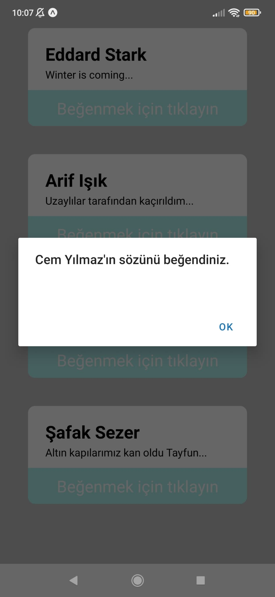
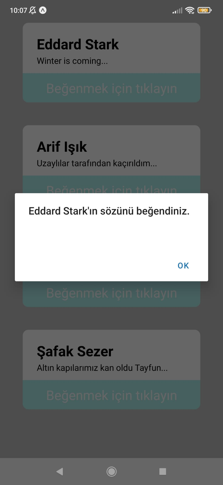

# Cards App 

It is a mobile application that we can view the words of famous people in the structure of cards and like them optionally.

## Pictures of the application

### Normal view of the application

### Image after liking an author's word

### Image after liking a different author's word

*
 - Author: [Berkay Emre BOĞUM](https://www.linkedin.com/in/berkay-emre-bo%C4%9Fum-058782240/) 
*
